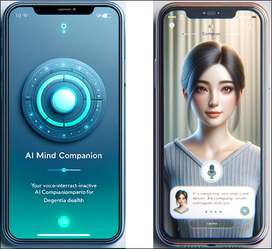

# CPSC 491 - Capstone Project #

This is our submission for the CPSC 491 Capstone Project.

## Project and Team Information ##

* Project: AI Mind Companion (Mobile App)
* Institution: California State University Fullerton (CSUF)
* Course: CPSC 491 - Senior Capstone Project (Spring 2024, Section 01/02, 19674/19689)
* Professor: Kyoung-Seop Shin
* Team Name: AI Alchemists (Group 12)

	* Name: Josue Han Yan Tai Liu
		* Role: PM, Team Lead, Developer
		* Email: josue.tai@csu.fullerton.edu

	* Name: Kyle Whynott
		* Role: Developer
		* Email: kwhynott@csu.fullerton.edu

	* Name: Ranny Naing
		* Role: Developer
		* Email: khant_naing@csu.fullerton.edu

	* Name: David-Alexander C Nhan
		* Role: Developer
		* Email: davidalexnhan@csu.fullerton.edu

## Dev Notes ##

* The methodology used for our SDLC is Scrum (agile) methodology.
* SDLC and CI/CD pipeline are managed using Jira Software, Confluence and GitHub integrated with each other.
* When doing GIT Commits please make reference to the ticket/issue on Jira.
	* i.e. use command $git commit -m "AMC-5 Updated README.md"
* When creating dev branches also make reference to the ticket/issue on Jira.
	* i.e. use command $git checkout -b AMC-5-devbranch01

## Project Timeline ##

Jira Project: [Click here](https://cpsc-491-ai-alchemists.atlassian.net/jira/software/projects/AMC/boards/1)
- [x] Sprint 0 - 01/02/2024 to 02/12/2024
	- Planning and Preparation phase.
- [x] Sprint 1 - 02/12/2024 to 03/04/2024
- [x] Sprint 2 - 03/04/2024 to 03/18/2024
- [x] Sprint 3 - 03/18/2024 to 04/08/2024
- [ ] Sprint 4 - 04/08/2024 to ...

## Project Abstract ##

* The escalating prevalence of dementia, notably Alzheimer's Disease (AD), necessitates innovative early detection mechanisms to mitigate its impact and enhance the quality of life for affected individuals. This project endeavors to develop a mobile application that functions as a voice-interactive AI companion to provide a user-friendly platform for early dementia detection. Unlike existing mobile applications that employ standard cognitive tests, our AI companion facilitates natural conversation with users, analyzing their voice samples to detect early signs of dementia. Employing the advanced capabilities of OpenAI's GPT-3.5 and GPT-4 models, fine-tuned for our project's objective, alongside Speech-to-Text and Natural Language Processing (NLP) techniques, our application aims to offer a subtle and continuous analysis of a user's cognitive health.

* At the core of our application is a virtual AI friend akin to the Replika App, albeit with a primary focus on dementia detection through voice analysis rather than extensive UI or avatar customization. This AI companion is designed to adapt over time, learning about the user, thus forming a supportive "friend" that can subtly assess cognitive health during interactions. The AI's capability extends to subtly altering its interaction method based on the user's cognitive state, providing gentle suggestions for mind-engaging activities to aid in cognitive health management.

* Our project stands at the intersection of AI, healthcare, and user-centered design, aspiring to fill a significant gap in publicly available dementia detection tools. By making early dementia detection accessible through a user-friendly mobile application, we aim to foster proactive cognitive health management within the community.

* Tentative Prototype Image of the app:
	
